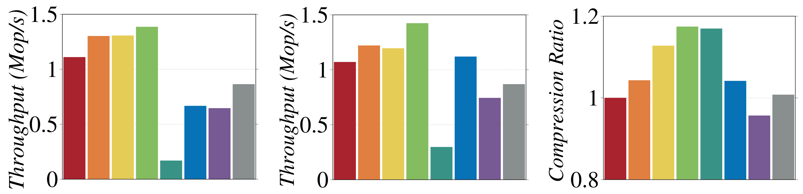

# Revisiting B-tree Compression: An Experimental Study

This repository hosts the source code and supplementary materials for our SIGMOD 2024 paper, "Revisiting B-tree Compression: An Experimental Study". We implemented 8 types of B-trees based on different compression techniques from scratch.

## Code Structure

The rough code structure is displayed below, omitting some auxiliary files (e.g. cmake files).
```bash
├── benchmark                      # Folder for benchmark codes
├── compression                    # Folder for compression handling codes
│   ├── compression_[method].cpp   
│   ├── compression_[method].h
├── README.md
├── tree                           # Folder for trees' data structures 
│   ├── btree_[method].cpp         # Definitions of the tree using [method]
│   ├── btree_[method].h           # Declarations of the tree using [method]
│   ├── node.cpp                   # Definitions of different types of nodes
│   ├── node.h                     # Nodes' declarations and definitions of headers
│   └── node_inline.h              # Macros and inline functions for accessing and updating metadata 
├── tree_disk                      # Folder for disk-based trees, similar as tree
│   ├── btree_disk_[method].cpp
│   ├── btree_disk_[method].h
│   ├── dsk_manager.cpp            # Disk management
│   ├── node_disk.cpp
│   ├── node_disk.h
│   └── node_disk_inline.h              
└── utils                          # Folder for utility functions
    ├── compare.cpp                # Utility for comparisons
    ├── config.h                   # Configurations
    ├── item.hpp                   # Definition of the data unit
    └── util.h                     # Utility for data processing and generate summary      
```

## Usage
```bash
# compile and build
mkdir build && cd build 
cmake -DCMAKE_BUILD_TYPE=Release .. && make 

# run the benchmark

./Benchmark -b [insert/insert,search/insert,search,range] \  # type of benchmark
            -n [key_num] \              # number of keys, enable to truncate the dataset 
            -i [iter_num] \             # number of iterations, default = 5
            -d [dataset_name] \         # path of the dataset 
            -o [path_to_results_file] \ # path to a summary of the results (optional)
            -r [range_query_num] \      # number of the range query
            -l [max_key_length]         # max key length, enable to truncate each key
```


We provide a readable summary in screen output, and you can also export a format suitable for csv or table files by specifying the `-o`. An example of a screen output summary shows as follows:

```bash
Finish [insert,search]: size=1000000, iter=1, 0.4 minutes.
=================================================================================================================
                                        PERFORMANCE BENCHMARK RESULTS - insert
=================================================================================================================
Index Structure |      Min      |      Max      |      Avg      |      Med      | M Ops/s (Avg) | M Ops/s (Med) |
-----------------------------------------------------------------------------------------------------------------
Btree-Std       |      0.9353s  |      0.9353s  |      0.9353s  |      0.9353s  |      1.0692   |      1.0692   |
Btree-Head      |      0.9136s  |      0.9136s  |      0.9136s  |      0.9136s  |      1.0945   |      1.0945   |
Btree-Tail      |      1.2517s  |      1.2517s  |      1.2517s  |      1.2517s  |      0.7989   |      0.7989   |
Btree-He+Tail   |      1.0016s  |      1.0016s  |      1.0016s  |      1.0016s  |      0.9984   |      0.9984   |
Btree-WT        |      3.3092s  |      3.3092s  |      3.3092s  |      3.3092s  |      0.3022   |      0.3022   |
Btree-My        |      1.4569s  |      1.4569s  |      1.4569s  |      1.4569s  |      0.6864   |      0.6864   |
Btree-PkB       |      1.4206s  |      1.4206s  |      1.4206s  |      1.4206s  |      0.7039   |      0.7039   |
Btree-DB2       |      1.1694s  |      1.1694s  |      1.1694s  |      1.1694s  |      0.8551   |      0.8551   |
=================================================================================================================
                                        PERFORMANCE BENCHMARK RESULTS - search
=================================================================================================================
Index Structure |      Min      |      Max      |      Avg      |      Med      | M Ops/s (Avg) | M Ops/s (Med) |
-----------------------------------------------------------------------------------------------------------------
Btree-Std       |      0.8381s  |      0.8381s  |      0.8381s  |      0.8381s  |      1.1932   |      1.1932   |
Btree-Head      |      1.2099s  |      1.2099s  |      1.2099s  |      1.2099s  |      0.8265   |      0.8265   |
Btree-Tail      |      0.8587s  |      0.8587s  |      0.8587s  |      0.8587s  |      1.1646   |      1.1646   |
Btree-He+Tail   |      0.7904s  |      0.7904s  |      0.7904s  |      0.7904s  |      1.2652   |      1.2652   |
Btree-WT        |      2.9153s  |      2.9153s  |      2.9153s  |      2.9153s  |      0.3430   |      0.3430   |
Btree-My        |      0.9242s  |      0.9242s  |      0.9242s  |      0.9242s  |      1.0820   |      1.0820   |
Btree-PkB       |      1.3150s  |      1.3150s  |      1.3150s  |      1.3150s  |      0.7604   |      0.7604   |
Btree-DB2       |      1.0117s  |      1.0117s  |      1.0117s  |      1.0117s  |      0.9885   |      0.9885   |
=================================================================================================================
                                        TREE STATISTICS BENCHMARK RESULTS
=================================================================================================================
Index Structure |      Height   | Avg Key Size  |  Prefix Size  |  Avg Fanout   | Total Nodes   | Non-leaf #    |
-----------------------------------------------------------------------------------------------------------------
Btree-Std       |      5.0000   |     36.0000   |      0.0000   |     18.1451   |  60515.0000   |   3335.0000   |
Btree-Head      |      5.0000   |     32.4757   |      0.1902   |     20.2763   |  53713.0000   |   2649.0000   |
Btree-Tail      |      4.0000   |     34.5062   |      0.0000   |     58.6370   |  59283.0000   |   1011.0000   |
Btree-He+Tail   |      4.0000   |     30.8985   |      0.2050   |     89.7674   |  52874.0000   |    589.0000   |
Btree-WT        |      4.0000   |     32.0305   |      2.0000   |     61.5301   |  55255.0000   |    898.0000   |
Btree-My        |      5.0000   |     33.0484   |      2.0000   |     18.7821   |  56366.0000   |   3001.0000   |
Btree-PkB       |      5.0000   |     42.0000   |      5.8782   |     16.2478   |  69103.0000   |   4253.0000   |
Btree-DB2       |      5.0000   |     33.3584   |      1.5210   |     20.8700   |  52510.0000   |   2516.0000   |
```

## Performance

In our paper, we conducted the comparison and analyzed the results on both synthetic and real datasets, and finally found that Head+Tail wins on most datasets.

For example, the results on TPC-H LINEITEM is shown below.

##### Results on TPC-H LINEITEM
<center class="half">
     
     <figcaption>&nbsp&nbsp&nbsp&nbsp&nbsp&nbsp(a) Insert Performance &nbsp&nbsp&nbsp&nbsp&nbsp&nbsp&nbsp&nbsp&nbsp (b) Seacrh Performance &nbsp&nbsp&nbsp&nbsp&nbsp&nbsp&nbsp  (c) Compression Ratio</figcaption>
</center>

